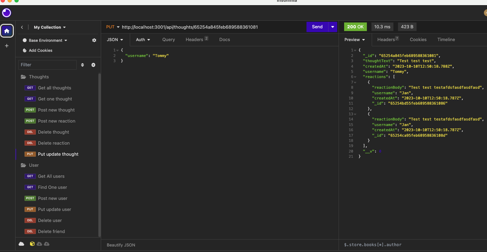

# NoSQL Challenge: Social Network API

## Description

My NoSQL Social Network API is a Node.js application programming interface (API) which allows for multiple social network operations on model data. As of now, there are users, thoughts, reactions, and friends.

## Installation

clone code from github repository.

## User Story

AS A social media startup
 
I WANT an API for my social network that uses a NoSQL database
 
SO THAT my website can handle large amounts of unstructured data

## Acceptance Criteria

GIVEN a social network API
 
WHEN I enter the command to invoke the application
 
THEN my server is started and the Mongoose models are synced to the MongoDB database
 
WHEN I open API GET routes in Insomnia for users and thoughts
 
THEN the data for each of these routes is displayed in a formatted JSON
 
WHEN I test API POST, PUT, and DELETE routes in Insomnia
 
THEN I am able to successfully create, update, and delete users and thoughts in my database
 
WHEN I test API POST and DELETE routes in Insomnia
 
THEN I am able to successfully create and delete reactions to thoughts and add and remove friends to a user’s friend list

## Usage

These are the available endpoints:
 
GET /api/users - get all users
 
GET /api/users/:userId - get a single user by ID
 
POST /api/users - create a new user
 
PUT /api/users/:userId - update a user by ID
 
DELETE /api/users/:userId - delete a user by ID
 
GET /api/thought - get all thought
 
GET /api/thought/:thoughtId - get a single thought by ID
 
POST /api/thought - create a new thought
 

PUT /api/thought/:thoughtId - update a thought by ID
 
DELETE /api/thought/:thoughtId - delete a thought by ID
 
POST /api/thought/:thoughtId/reactions - add a reaction to a thought
 
DELETE /api/thought/:thoughtId/reactions/:reactionId - remove a reaction from a thought
 
POST /api/users/:userId/friends/:friendId - add a friend to a user's friend list (Current difficulties)
 
DELETE /api/users/:userId/friends/:friendId - remove a friend from a user's friend list

## Screenshot

## Credits

Skyler Keeling

## License

MIT

 
https://www.mit.edu/~amini/LICENSE.md

## Personal

https://github.com/SkylerKeeling
